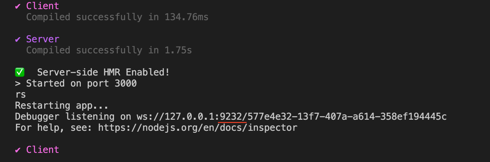
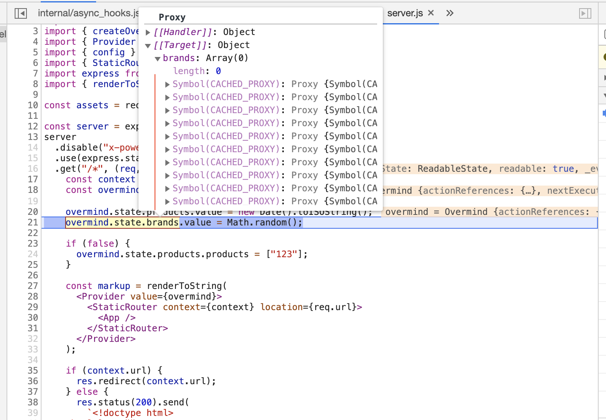
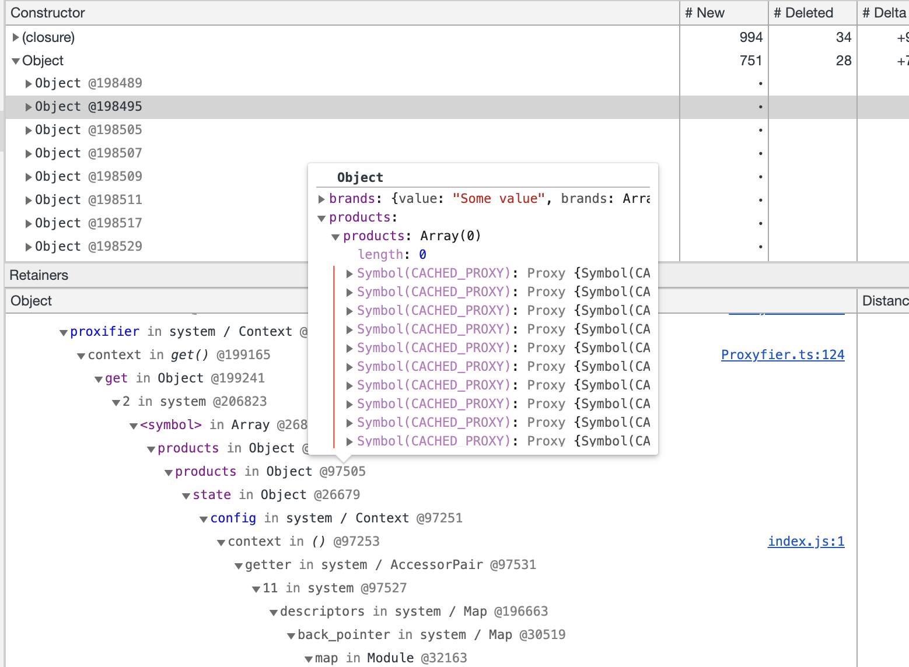

## Steps to reproduce
first
```bash
 npm install
```

then

```bash
 npm start -- --inspect-brk
```

then look at the port debugger has chosen (it should assign 9229 by default but it doesn't):



Attach debugger. Try to refresh the page several times. Stop at the line 25 `in server.js`

Look at the content of `overmind.state.brands.brands`:
You should see something like:



alternatively you can start the app, make a heap snapshot via chrome node inspector

refresh page 30 times

make another snapshot

check both in comparison mode. You should see something like:




I also placed two snapshots in `./misc` folder. First leak-1, second leak-2. You can load them in nodejs inspector and take a look ath the objects in the heap.
